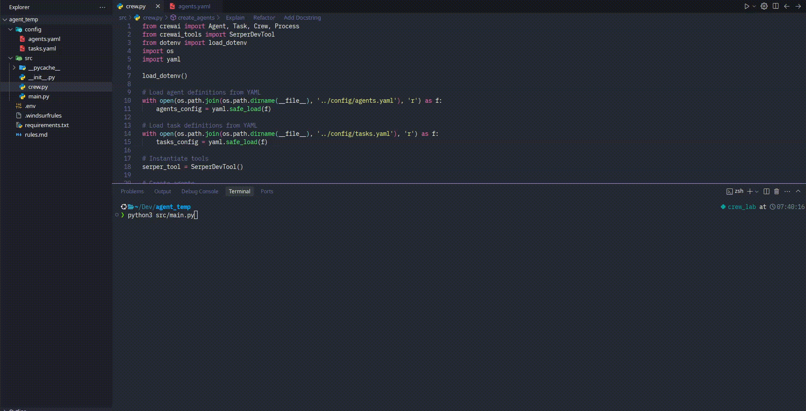

# About the Agent
- This code was created to test the heuristics described in [`rules.md`](rules.md).
- Make adjustments as needed for your use case.
- Change the LLM model connection; this example uses GEMINI with an API_KEY created in [Google AI Studio](https://aistudio.google.com/).
- Update the .env file with the API keys you intend to use.

# Example Agent News

This directory contains an example agent for searching and delivering news, using the CrewAI infrastructure.

## Prerequisites
- Python 3.8+
- Install the project dependencies (check the `requirements.txt` file in the project root or in this directory)

## Installation
1. Clone the repository (if you haven't already):
   ```bash
   git clone <REPOSITORY_URL>
   cd rules_guidelines_crewai/example_agent_news
   ```
2. Install the dependencies:
   ```bash
   pip install -r requirements.txt
   ```

## How to Run
Run the example agent with:
```bash
python3 src/main.py
```

## Demo
